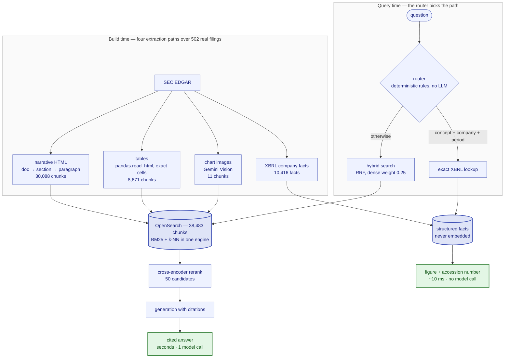
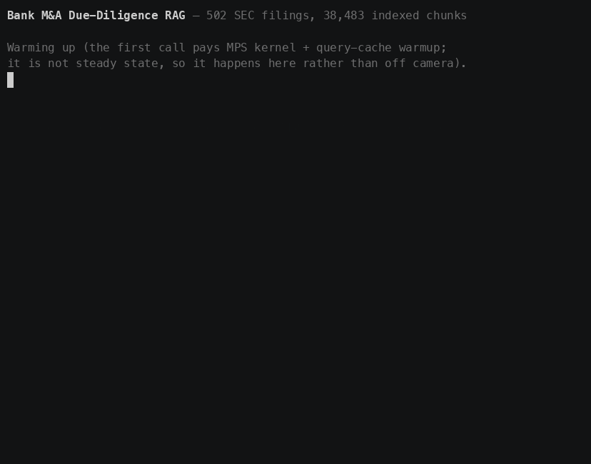

# Bank M&A Due-Diligence RAG

A retrieval-augmented question-answering system over **real SEC EDGAR
filings**, built around Columbia Banking System's 2023 merger of equals with
Umpqua Holdings — a real, public, independently fact-checkable transaction —
plus three more regional banks (Glacier Bancorp, WesBanco, South State) for
corpus breadth and cross-company comparison.

**502 real filings. 38,483 indexed chunks. No synthetic data.**

Factual questions ("What was Columbia's net income for 2023?") route to an
exact XBRL lookup and return a figure traceable to the accession number that
reported it. Narrative questions ("What are the risks of the Umpqua
merger?") route to hybrid search with cross-encoder reranking and cited
generation.

---

## Architecture



XBRL facts are deliberately **never embedded**. `NetIncomeLoss = 348715000
USD CY2023` has no useful semantic neighbourhood; it is answered by lookup.

| Component | Choice | Why |
|---|---|---|
| Store | OpenSearch 2.19.1 | One engine for BM25 *and* k-NN — hybrid search is one query, not a cross-system fan-out |
| Embeddings | `BAAI/bge-small-en-v1.5` (384d) | Self-hosted, small enough to embed 38k chunks on a laptop. A domain fine-tune of it was trained and measured: **+0.233 dense recall@10** on the held-out split, and **+0.000** once the pipeline's reranker runs — see below |
| Reranker | `ms-marco-MiniLM-L-6-v2` | Cross-encoder over 50 candidates; the single biggest quality win |
| Generation | Gemini free tier | Multimodal (also drives chart understanding), no card required |
| API | FastAPI | Deliberately different from this author's other project's gRPC stack |

---

## Seeing it work

Both query paths, against the live API and the real 38,483-chunk index.
Reproduce it with `./scripts/demo.sh`; the raw asciicast is
[`docs/assets/demo.cast`](docs/assets/demo.cast).



The factual question resolves to `NetIncomeLoss` for `COLB` in fiscal 2023,
returns **$348,715,000** and the accession number of the filing that
reported it — `0000887343-24-000089` — and does so having retrieved zero
passages and called zero models. The narrative question has no complete
`(concept, company, period)` key, so it falls through to hybrid search,
reranking and generation, and its `[n]` markers resolve to real filings
listed beneath the answer with their SEC URLs.

The timings on screen are one call each on one 8 GB laptop, and no report
file records them: `results/retrieval/report.json` measures the *retrieval*
stage in isolation (BM25 14 ms, dense 23 ms, hybrid 39 ms, hybrid+rerank
346 ms, means over 101 questions), not end-to-end `/ask`, and the seconds in
the semantic path are dominated by the generation call those figures exclude.
Read the recording as a demonstration of the two paths, and the table below
as the measurement.

The demo spends its warmup request on camera rather than off it: the first
`/ask` after process start has been traced at 2,995 ms, almost all of it MPS
kernel warmup and cold OpenSearch query caches, and quietly excluding it
would flatter the system.

---

## Headline result: reranking, not embeddings

Measured on 101 questions against the full 38,483-chunk index. All 101 are
human-verified, and every eval report prints that count so a self-graded set
cannot be mistaken for a curated one.

| retriever | recall@1 | recall@5 | recall@10 | MRR | nDCG@10 |
|---|---|---|---|---|---|
| dense (bge-small-en-v1.5) | 0.158 | 0.277 | 0.322 | 0.208 | 0.233 |
| BM25 | 0.282 | 0.500 | 0.604 | 0.399 | 0.441 |
| hybrid (RRF, dense weight 0.25) | 0.218 | 0.485 | 0.663 | 0.361 | 0.424 |
| **hybrid + cross-encoder rerank** | **0.302** | **0.579** | **0.703** | **0.435** | **0.493** |

**+0.099 recall@10 over the strongest single retriever**, at 24x the
latency (346 ms against BM25's 14 ms). Latencies in
`results/retrieval/report.json` are machine-dependent — this is an 8 GB
laptop also running OpenSearch, and an earlier run of the identical code
recorded figures 6x higher because it shared the machine with other work —
so treat their ratios rather than their absolute values as meaningful.

Three findings worth more than the headline number:

**1. Dense retrieval lost badly to BM25 here — 0.322 vs 0.604 recall@10.**
Not the expected result, and the breakdown says why: on serialized financial
tables dense scores 0.20 against BM25's 0.42. A 384-dimensional semantic
embedding of a table that reads `Balance at January 1, 2019 | 73249 | $ |
1642246 | ...` carries little signal, while exact lexical matching handles
it. Dense is only competitive on chart descriptions (0.60 here, 1.00 for BM25), which are the
one part of the corpus written as natural prose.

**2. Naive RRF fusion made things worse, and the ablation shows the fix.**
Equal-weight fusion scored *below* BM25 alone on precision (recall@1 0.183
vs 0.275), and weighting dense higher was worse still (0.148 at dense-only).
Sweeping the dense weight from 0 to 1 (`results/ablations`) showed why — the
weaker retriever pollutes the top ranks — and that 0.25 is the best setting,
recovering recall@10 0.662.

**3. The chunk hierarchy helps as context but crowds the top ranks.** On
the 25 development-split questions whose answer is a paragraph, restricting
the searchable pool to paragraphs only moves recall@1 from 0.320 to
**0.440** and nDCG@10 from 0.588 to **0.646** against searching every level.
It costs a little recall@10 — 0.880 to 0.860, half a question — so the other
levels are not useless; they occasionally carry the answer. But they are
distractors where it matters most, at the top of the ranking. This is what
motivates the router.

Reranking depth was also swept, and returns stop early: recall@10 peaks at
**25** candidates (0.732), and 100 is worse than both 25 and 50 (0.704) at
**596 ms** against 216 ms. A deeper pool gives the cross-encoder more
chances to promote a distractor. The configured depth of 50 sits between
them deliberately — it buys back the precision that depth 25 gives up
(recall@1 0.303 against 0.289) at the same recall@5.

### Three caveats that belong next to those numbers

- **The absolute values are a lower bound.** Relevance labels come from a
  stratified sample of 163 chunks, not exhaustive judgments over all 38,483.
  Verified by inspection: for *"What is the date of the merger agreement
  between Columbia and Umpqua?"*, the dense retriever's top three hits all
  correctly state October 11, 2021 — and all scored as misses, because the
  label points at an exhibit-index table that answers the question worse.
- **The questions were written by reading the labelled chunks**, so they
  share vocabulary with them, which structurally favours lexical matching.
  The dense-vs-BM25 gap is real but is probably overstated by this eval set.
- **The fusion weight was tuned on these questions.** Every table above is
  scored on all 101, and the 0.25 dense weight was selected by sweeping
  against them, so recall@10 0.663 for hybrid is optimistically biased. The
  size of that bias is bounded — one parameter, five values — but it is not
  zero.

Comparisons *between* retrievers on this fixed set remain sound, which is
why the reranking delta is the headline rather than the absolute level.

### The held-out split

Every eval row carries a `split`: 71 development, 30 test, stratified across
question type and chunk type, drawn only from human-verified rows and frozen
once written. Re-running the assignment leaves existing rows alone, so a
later verification pass can extend the set without re-drawing the partition
into a more favourable one.

The ablation sweep asks for the development split *explicitly*, so no tuning
decision can reach the test questions by omission. The test split has never
been swept against, and exists so the fine-tune delta can be reported on
questions no tuning decision has touched. The comparison table above is
still scored on all 101 — it predates the split and reproduces exactly, which
is why it is presented as-is rather than silently restated on a subset.

Thirty questions is a small test set, and a delta measured on it will have
correspondingly wide error bars. That is a real limit on the resolution of
any future claim, and stating it is cheaper than a contaminated 101.

---

## The fine-tune: a large dense gain the pipeline throws away

Dense retrieval lost to BM25 by roughly 2x on this corpus, which reads as a
domain gap rather than a fusion problem, so the bi-encoder was fine-tuned on
4,776 synthetic queries mined into hard-negative triplets ([ADR
0005](docs/adr/0005-fine-tune-the-bi-encoder.md); one epoch, 121 s on an RTX
5070, `results/training/report.json`). The result was measured as a **four-run
matrix** — off-the-shelf and fine-tuned, each with and without the
cross-encoder — because those two pairs answer different questions and only
one of them describes the served system.

Headline on the **held-out test split** (30 questions, all human-verified),
`results/finetune_delta/report.json`:

| retriever | recall@10 base → tuned | Δ recall@10 | Δ MRR |
|---|---|---|---|
| dense | 0.367 → **0.600** | **+0.233** | +0.123 |
| BM25 (unchanged by construction) | 0.600 → 0.600 | +0.000 | +0.000 |
| hybrid (RRF, dense weight 0.25) | 0.667 → 0.667 | +0.000 | +0.047 |
| **hybrid + cross-encoder rerank** | 0.667 → 0.667 | **+0.000** | **+0.000** |

The bi-encoder gain is real and large: on the held-out questions the
fine-tuned dense retriever reaches **parity with BM25** (0.600 vs 0.600),
closing the gap that motivated the training run. It reproduces across splits
— +0.233 on test, +0.232 on dev, +0.233 on all 101 — and it is concentrated
exactly where dense was weakest. Over all 101 questions, dense recall@10 by
chunk type moves 0.200 → **0.550** on tables (n=40) and 0.350 → **0.650** on
sections (n=20), against 0.414 → 0.457 on paragraphs (n=35).

**And the deployed pipeline's number does not move at all.** Not
approximately: the cross-encoder returned *byte-identical* result lists on
all 101 questions in both arms. The reason is arithmetic, and
`scripts/verify_rerank_pool.py` checks it against the live index rather than
asserting it. RRF scores a document `weight / (60 + rank)`, so a document only
dense retrieval found scores at best `0.25 / 61`, while BM25's document at
candidate depth `c` scores `1 / (60 + c)` — the dense-only document wins only
once `c > 184`. The pipeline runs at 50. Measured on the test split: the
fused candidate pool equals BM25's candidate set on **30/30** questions in
both arms, identical as sets on 30/30 and identical in order on 0/30. The
fine-tuned embeddings reorder the pool the reranker is handed and never
change its membership — and reordering is the one thing a cross-encoder
discards.

So the honest reading is three sentences, not one. The fine-tune worked. The
reranked configuration this repository ships cannot see it, for a reason in
the fusion settings rather than in the model. Anyone reporting only the
+0.233 would be describing a system nobody runs, and anyone reporting only the
+0.000 would be calling a working fine-tune a failure.

**What this does and does not establish.** The digest manifest that ties these
weights to that training run (`results/training/checkpoint.json`, written by
`scripts/transfer_checkpoint.py manifest` on the training machine and carried by
git) is committed, and **the weights match it**: `model.safetensors`, all
133,462,128 bytes, plus the tokenizer, the architecture config and both nested
module configs. So the delta above is an attributable measurement of the trained
model. The checkpoint *directory* is not clean, though —
`transfer_checkpoint.py verify` exits 1 on `modules.json`, a 410-byte module
list that carries no weights and was rewritten locally after the checkpoint
arrived, to a form this machine's older sentence-transformers can load. That is
why `results/finetune_delta/report.json` still reports
`weights_traceable_to_this_run: false`: the field is set by an actual digest
comparison rather than by the manifest's presence, because a manifest that
merely exists would make a corrupted checkpoint read as verified. The full
file-by-file account is in the [model card](docs/model-card.md#provenance-what-ties-these-weights-to-that-run).
Separately, the two indexes were confirmed to hold different models' vectors
with each holding its own (cos 1.000000 against its own model, 0.857 against the
other's, `results/index/report.json`), which rules out one arm querying the
wrong index. The eval-set caveats above apply unchanged, and to both arms
equally.

Everything about the model itself — training data, the contamination guard, the
split discipline, hyperparameters, intended use, limitations, and what shipping
no weights costs the claim — is in the **[model card](docs/model-card.md)**.

---

## Structured routing: the exact-answer path

A deterministic rule set — not an LLM call — decides whether a question is a
lookup or a search. An LLM router would add an unpredictable failure surface
in front of a system whose selling point is traceability, cost a request
against a 20/day quota, and resist unit testing.

```
$ curl "localhost:8000/route?question=What was Columbia's net income for 2023?"
{"route": "structured", "concept": "NetIncomeLoss", "company": "COLB",
 "fiscal_year": 2023,
 "reasons": ["matched XBRL concept NetIncomeLoss via 'net income'",
             "identified company COLB", "identified fiscal year 2023",
             "concept + company + period form a complete lookup key"]}
```

A structured route requires **all three** of concept, company and period.
"What was net income?" names a concept but no company or year — there is no
row to fetch, so it falls back to search rather than guessing which of five
banks was meant. Narrative markers ("why", "explain", "compare") veto a
structured route even when the key is complete.

**Structured exactness: 3/3** against `data/extraction_eval_set.jsonl`,
whose values were verified by hand against the filings' own MD&A prose. This
is the only eval in the project with an unambiguous right answer.

The routing *classification* score (36/36) is reported in
`results/routing/report.json` but is explicitly labelled a regression test,
not evidence: the rules and the test cases share an author.

---

## Every number above maps to an artifact you can re-run

This project's rule is that no number appears in this README unless a script
produced it and a report file records it. Where something is unverified,
partial, or a lower bound, it says so.

| Claim | Artifact | How to reproduce |
|---|---|---|
| 502 filings, 5 companies, real accession numbers | `data/manifest.json` | `python scripts/fetch_filings.py` |
| 30,088 narrative chunks (502 doc / 1,442 section / 28,144 paragraph) | `data/chunks/*.jsonl` | `python scripts/run_ingestion.py` |
| 8,671 table chunks with exact cell values (69 tables of contents excluded) | `data/tables/*.jsonl` | same |
| 10,416 XBRL structured facts | `data/facts/*.jsonl` | same |
| 11 chart descriptions (Gemini Vision) | `data/chunks_charts/*.jsonl` | `python scripts/run_chart_extraction.py` |
| XBRL extraction accuracy **3/3 (100%)** | `results/extraction/report.json` | `python -m duediligence.eval.run_extraction_eval` |
| Chart understanding **3/3** hand-graded | `results/charts/report.json` | `python -m duediligence.eval.run_chart_eval` |
| Retrieval: dense / BM25 / hybrid / +rerank | `results/retrieval/report.json` | `python -m duediligence.eval.run_retrieval_eval` |
| Fusion-weight, chunk-level, rerank-depth ablations (development split) | `results/ablations/report.json` | `python scripts/run_ablations.py` |
| Fine-tune delta, four-run matrix (headline on the test split) | `results/finetune_delta/report.json` + the four run reports beside it | `python scripts/run_finetune_delta.py` |
| Why the reranked delta is zero: fused pool == BM25's candidates, 30/30 | `results/finetune_delta/rerank_pool.json` | `python scripts/verify_rerank_pool.py` |
| Fine-tuned index holds the fine-tuned model's vectors (cos 1.000000 own / 0.857 other) | `results/index/report.json` | `python scripts/verify_index_parity.py` |
| Either profile served by env var alone; each arm's `/readyz` names the model and index it loaded; reranked lists identical across arms, un-reranked pools identically populated but differently ordered | `results/serving/profile_check.json` | `python scripts/verify_served_profile.py` |
| Frozen 71/30 development/test split, stratified | `split` field in `data/eval_set.jsonl` | `python scripts/assign_eval_splits.py --dry-run` |
| 4,776 synthetic training queries, mined into hard-negative triplets, eval-contamination guarded | `data/training/synthetic_queries.jsonl` tracked; the mined splits are regenerable and gitignored, with row samples tracked | `python scripts/generate_synthetic_queries.py` then `python scripts/mine_hard_negatives.py` |
| Routing + structured exactness **3/3** | `results/routing/report.json` | `python -m duediligence.eval.run_routing_eval` |
| Kubernetes deployment, probes, Service routing | `results/deployment/k8s_verification.json` | `kind create cluster && kubectl apply -f k8s/` |
| Both query paths answering, end to end | `docs/assets/demo.cast` | `asciinema rec docs/assets/demo.cast -c ./scripts/demo.sh` |
| CI green on `main`: lint+unit, integration vs real OpenSearch, image build+boot, kind manifest validation, Terraform validate | [GitHub Actions](https://github.com/Dayallenr/RAG/actions/workflows/ci.yml) | `.github/workflows/ci.yml` |
| 543 passing tests, ruff clean | — | `pytest -q && ruff check .` |
| Every eval above also logged to a public tracker: **5,100/5,100 hosted metrics match `results/`** | `results/tracking/report.json` | `python scripts/verify_wandb_runs.py` |

### The same numbers, hosted where this repository cannot edit them

Every evaluation and ablation run is also logged to a public Weights & Biases
project:

**<https://wandb.ai/dayallenr30-university-of-california/duediligence-rag>**

A report file is only as trustworthy as whoever committed it. The hosted runs
are a different *kind* of evidence: they carry their own timestamps, they are
not writable from this repository, and they show the evaluation was executed
rather than that a number was typed.

That is worth nothing unless the hosted numbers are the same numbers, so it is
checked instead of asserted. `python scripts/verify_wandb_runs.py` reads the
project **with no credentials** — the same anonymous read a stranger gets,
which is also how it establishes the project really is public, since a private
one returns nothing to an anonymous caller — and compares every hosted metric
against its report file on disk, using the same flattening that produced the
hosted keys. **786 of 786 match** across the five runs
(`results/tracking/report.json`). It exits non-zero if a report is ever
regenerated without tracking on, which is exactly how a link like this goes
quietly stale.

The project keeps superseded runs — earlier passes of the retrieval eval and
ablations, and the groundedness runs from before any answer had been judged. A
run history with only the good runs left in it is not a run history. The
verification only ever cites the newest finished run of each name.

### What is *not* on that list, and why that matters

Everything above was produced by running the thing and is backed by a file
you can open. Three parts of this project are **not** on that list, and the
distinction is deliberate — reading code is not evidence that the code was
ever executed:

- **The AWS infrastructure has never been applied.** `terraform/` defines an
  OpenSearch domain and, behind an opt-in flag, a VPC/EKS/ECR stack. It
  passes `fmt` and `validate`, and CI enforces both — but validation proves
  the configuration is well-formed and nothing more. No AWS resource has
  ever been created from it, and the SigV4 signing path it would exercise in
  `duediligence/index/opensearch_client.py` has never run against a real
  domain.
- **Groundedness is measured on 14 of 68 eligible answers.** All 101 answers
  are generated and recorded, but each independent judgment costs a request
  against a 20/day Gemini quota, so `results/generation/report.json` reports
  a claim-support rate over 14 judgments — real, and too few to quote as a
  system-level number. (68 of the 101 are eligible: the 12 structured-route
  answers cite no passages and the 21 refusals assert no claim to support.)
- **The fine-tuned checkpoint verifies on its weights but not on one metadata
  file.** The digest manifest is committed and `model.safetensors` matches it
  byte for byte, so the delta is attributable to the trained model. But
  `scripts/transfer_checkpoint.py verify` exits 1 on `modules.json` — a
  410-byte module list, rewritten locally after arrival so an older
  sentence-transformers could load it — and this repository does not describe a
  failing check as a passing one. Closing it means re-running
  `transfer_checkpoint.py manifest` on the training machine against the
  checkpoint it still holds. The [model card](docs/model-card.md#provenance-what-ties-these-weights-to-that-run)
  has the file-by-file account.
- **The served pipeline still runs the off-the-shelf embedding model by
  default.** Every retrieval number outside the fine-tune section is
  `bge-small-en-v1.5`. The fine-tuned profile can now be served by setting one
  environment variable, and the service reports which model and index it
  actually loaded — verified end to end against the live index,
  `results/serving/profile_check.json`. Serving it changes nothing a user sees:
  with reranking on, both arms returned **identical result lists on all three
  probe queries**. With reranking off, the same two arms returned the **same 50
  candidates in a different order** on all three — which is #23's mechanism
  reproduced through the API rather than the eval harness: the fine-tuned
  bi-encoder reorders a pool whose membership it never changes, and reordering
  is exactly what the cross-encoder discards. The differing order is also what
  proves the arms really queried different vector spaces rather than the switch
  doing nothing. That is the finding, not an omission.

If any of those later becomes verified, it gets an artifact in the table
above and a line here — not a quiet edit to a sentence elsewhere. That has
already happened once: the evaluation set used to be listed here as
unverified, and it now has an artifact instead (see the held-out split
above).

---

## Running it

```bash
docker compose -f docker/docker-compose.yml up -d      # OpenSearch
python scripts/build_index.py --recreate               # embed + index (~10 min)
python -m duediligence.eval.run_retrieval_eval         # reproduce the table above
```

Reproduce the fine-tune delta, checkpoint to number. The profile is one
environment variable because it has to move the embedding model and the index
together — the config loader refuses a profile that changes one without the
other, since querying an index with the model it was not built from produces a
plausible ranking rather than an error:

```bash
# 1. the checkpoint lands at models/bge-small-duediligence (gitignored).
#    Either fetch it, or — if it arrived some other way — just verify it
#    against the manifest committed from the training machine.
python scripts/transfer_checkpoint.py pull --repo-id <user>/bge-small-duediligence
python scripts/transfer_checkpoint.py verify          # no Hub, no token
# 2. build its index — the baseline index is untouched
DUEDILIGENCE_CONFIG_PROFILE=finetuned python scripts/build_index.py \
  --recreate --batch-size 64
# 3. confirm each index holds its own model's vectors before trusting a delta
python scripts/verify_index_parity.py
# 4. the four-run matrix, then the comparison (writes results/finetune_delta/)
python scripts/run_finetune_delta.py
# 5. why the reranked cell is 0.000
python scripts/verify_rerank_pool.py
```

Step 4 runs each of the four cells in its own subprocess: this is an 8 GB
machine that already swaps, and two embedding models plus a cross-encoder
resident at once is how an earlier index build degraded from 80 chunks/s to 3.
Run it with nothing else heavy on the box. `--from-reports` recomputes the
comparison from reports that already exist.

Serve the API:

```bash
docker compose -f docker/docker-compose.yml --profile api up -d
curl -X POST localhost:8000/ask -H 'content-type: application/json' \
  -d '{"question": "What are the risks of the Umpqua merger?"}'
```

`./scripts/demo.sh` runs both query paths against a serving API and prints
what the recording above shows. The recording is that script under
`asciinema`, so re-recording it is one command:

```bash
asciinema rec docs/assets/demo.cast --overwrite --window-size 84x40 -c ./scripts/demo.sh
agg --theme asciinema --font-size 16 --speed 1.4 --rows 28 \
  docs/assets/demo.cast docs/assets/demo.gif
```

Nothing enforces that the committed recording matches the current code — no
test compares them — so treat it as a snapshot that has to be re-run by hand
when the output changes.

`/healthz` is liveness and never touches OpenSearch — a search blip must not
trigger pod restarts. `/readyz` is readiness and does check it. `/metrics`
exposes Prometheus counters, including the structured-vs-semantic split.

Both health endpoints also report the `model`, `index` and `profile` the
process actually loaded, read off the embedder rather than off config. An
embedding model and its index are a matched pair, and a container holding a
mismatched one raises nothing — cosine similarity across two incompatible
vector spaces is still a number, so the answers look ordinary and are built on
nothing. Reporting the pair is what makes that observable from outside:

```bash
python scripts/verify_served_profile.py   # both arms, real models, live index
```

That script is what produced the identity figures above: it stands the real app
up once per profile and records what each reported and returned. The equivalent
through compose is wired but **not exercised** — treat this block as
illustrative, not as observed output:

```bash
DUEDILIGENCE_CONFIG_PROFILE=finetuned docker compose \
  -f docker/docker-compose.yml --profile api up -d
curl -s localhost:8000/readyz
```

No image rebuild and no edited config file: `config/` already ships in the
image, so the switch is a restart with a different variable. The fine-tuned
weights are gitignored and are not in the image, so compose mounts `models/`
read-only for the profile that needs them — a path the verification script,
which runs in-process, does not cover.

Kubernetes manifests are in `k8s/` (OpenSearch as a StatefulSet, API as a
Deployment with an HPA) — **verified by deploying to a real cluster**, see
`results/deployment/k8s_verification.json`.

Terraform for AWS (OpenSearch domain; optionally VPC + EKS + ECR) is in
`terraform/`. **It has never been applied — no AWS resource has ever been
created from it.** It passes `fmt` and `validate` and CI enforces both, but
that proves only that the configuration is well-formed. It does not prove
the domain comes up, that the k-NN plugin behaves the same on AWS's managed
build, or that the SigV4 signing path in `opensearch_client.py` works —
that code has never run against a real domain. Treat it as reviewed
infrastructure code, not as a deployment.

---

## Honest status

**Complete and verified by running it:** ingestion, chunking, table and XBRL
extraction, chart understanding, embeddings and indexing, retrieval eval,
hybrid search, reranking, three ablations, query routing, structured lookup,
and the FastAPI service — the API was run against the live index and every
endpoint exercised (`/healthz`, `/readyz`, `/route`, `/ask` on both routes,
`/search` with filters, `/metrics`, and request validation).

**Container and Kubernetes deployment: verified by deploying it.**
`results/deployment/k8s_verification.json` records the run. The image builds
(2.13 GB) and runs as non-root `appuser`; the full stack was deployed to a
kind cluster, the StatefulSet's PVC bound, and both API replicas plus
OpenSearch reached Ready. The probe design was confirmed under real
conditions rather than asserted: while OpenSearch was still starting,
`/healthz` stayed 200 and `/readyz` returned 503, so pods were held out of
the Service without being restarted — and both flipped to Ready the moment
the index existed. Traffic through the Service reached `/healthz`,
`/readyz`, `/route` and `/metrics`.

One real limitation found this way: the HPA reports
`FailedGetResourceMetric` on kind, which ships without `metrics-server`. The
manifest is correct; `metrics-server` is a cluster prerequisite. The HPA was
observed working in one respect — it immediately restored `minReplicas: 2`
after a manual scale to 1.

The in-cluster OpenSearch held an empty index, so this validated deployment,
probes and routing — not retrieval quality in-cluster.

**Since verified, and recorded rather than quietly edited:**

- **The 101-question retrieval eval set was drafted mechanically, then
  verified by hand.** All 101 entries now carry `"verified": true`, and
  every report prints that count. Verification corrected **no** labels, so
  the re-run reproduced every quality metric bit-identically — which is the
  evidence that the earlier figures were not a self-grading artifact. Two
  limits survive verification and are stated with every number: labels
  average 1.02 chunks per question, so recall is a **floor, not an
  estimate**, and the questions were written by reading the chunks they are
  labelled against, which favours lexical matching.

**Not yet verified, and stated as such:**

- **Groundedness is judged on 14 of 68 eligible answers.** All 101 answers
  are generated and recorded (`results/generation/answers.jsonl`), but judging
  them costs a request against a 20/day Gemini quota, so
  `results/generation/report.json` reports a claim-support rate over **14**
  judgments — too few to quote as a system-level number. The harness
  (`scripts/judge_answers.py`) is resumable and continues where it left off.
- **Terraform has never been applied.** It passes `fmt` and `validate`, and
  CI enforces both, but no AWS resource has been created. Validation proves
  the configuration is well-formed and nothing more. See
  `terraform/README.md` for the cost breakdown and why it is gated.
- **The bi-encoder fine-tune is trained, indexed, measured and documented.** One epoch on an RTX 5070 (121 s), a 38,483-document index built
  from the checkpoint, and a four-run delta matrix: +0.233 dense recall@10 on
  the held-out split, +0.000 through the reranked pipeline for a structural
  reason measured in `results/finetune_delta/rerank_pool.json`. The digest
  manifest is committed and the weights match it; the checkpoint directory as a
  whole does not, on one metadata file. The
  [model card](docs/model-card.md) documents the model end to end, and ADR 0005
  records why the original no-fine-tuning rule was reversed.

**Previously-known defect, now fixed:** 69 of 8,740 table chunks were 10-Q
tables of contents. Two things were wrong — the exclusion regex required
whitespace after the item number (never present in a 10-Q, where the cell is
exactly `Item 1.`), and the threshold counted *cells*, which a table of
contents dilutes to ~14% with its title and page-number cells. Measuring
both populations across all 8,740 tables showed a row-based signal separates
them cleanly: genuine tables sit at 0.000 even at the 99th percentile, every
table of contents at 0.268+. The corpus is now 8,671 tables.

**What removing them was worth, measured — and it is small.** Running the
retrieval eval either side of the re-ingestion isolates the effect, and the
honest answer is that 69 chunks out of 38,483 move the top ranks a little
and the deeper ranks not at all. Dense recall@5 goes 0.257 → 0.277 and
recall@1 0.149 → 0.158 (one question of 101); MRR and nDCG@10 rise by
0.007 and 0.005. BM25's recall is unchanged at every k (its MRR and nDCG@10
slip by 0.0002), every retriever's recall@10 is unchanged, and the reranked
figures are unchanged. By chunk type the one visible move is hybrid on paragraph questions,
0.800 → 0.829, against hybrid on table questions going the other way,
0.450 → 0.425.

That is the expected shape rather than a disappointment: a table of contents
is lexically stuffed with the section headings a narrative question uses, so
it competes for the *top* ranks it can least answer — which is where dense
retrieval and MRR moved — while a retriever that was going to find the right
chunk by rank 10 still does. The defect was worth fixing because the corpus
is wrong with it in, not because it was costing recall.

These figures come from runs either side of the re-ingestion commit rather
than from two live indices A/B'd against each other, so read them as a
before-and-after, not a controlled experiment. The ablation report was also
stale against this fix — it had never been re-run — and its all-levels
configuration did not reproduce the contemporaneous retrieval eval on
identical settings. It has been re-run; the two agree exactly on the same
questions (0.88 on the 25 development-split paragraph questions), and
finding 3 above is stated from the re-run.

---

## Things that broke, and what they taught

The value of running this against real data rather than a clean dataset is
the list of things that were wrong:

- **SEC's `fy`/`fp` fields describe the filing, not the fact.** Columbia's
  FY2023 10-K reports 2021, 2022 *and* 2023 net income as comparatives, all
  tagged `fy=2023, fp=FY`. Selecting on that label returned **$336.8M** (the
  2022 figure) for a 2023 question against a verified $348.7M. Only
  `start`/`end` dates disambiguate them — and two facts were colliding on an
  identical content-addressed ID as a result.
- **A later filing is not a better source.** The same period appears rounded
  to $349,000,000 in a 2026 filing — which is also the value SEC promotes
  into its normalized `CY2023` frame. The original as-filed figure is the
  traceable one.
- **Section chunks were empty.** All 1,442 held only their heading. A chunk
  whose entire text is `"Item 1A. Risk Factors"` was the top-scoring dense
  hit for a merger-risk query while containing nothing that answers it.
- **8 GB of RAM is a real constraint.** Indexing appeared to "degrade" from
  90/s to 20/s across two runs. It was not a leak: the JVM, Docker's VM and
  a resident torch model don't fit, and the machine swapped. Diagnosis was
  misdirected by `ps` showing 2.7% CPU — **MPS work runs on the GPU and does
  not register as process CPU time**, so low CPU% does not mean blocked.
- **Terraform caught its own dependency cycle.** The domain's access policy
  needed the domain's ARN while the domain needed the rendered policy;
  `validate` refused it, and the fix was a separate policy resource.

Earlier findings — the table of contents duplicating every heading, filers
splitting words across `<span>` runs, `pandas.read_html` requiring bytes not
`str`, 140 layout tables per 10-K, and only 11 genuine charts among 894
`` tags — are documented in
[`docs/engineering-notes.md`](docs/engineering-notes.md).
